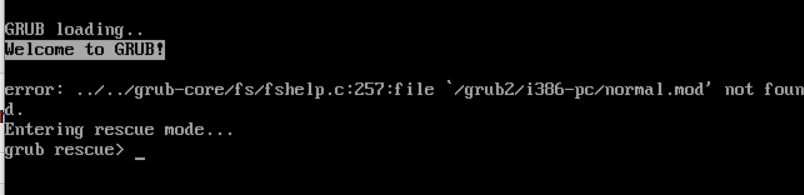

Title: Fixing "Missing GRUB File"

Problem:

The user is unable to boot into the Linux machine. Upon startup, the system drops to the GRUB rescue prompt instead of loading the operating system. This indicates that the GRUB bootloader is missing or corrupted.

Troubleshooting/Diagnose

	1. Booted into rescue mode using a Linux installation medium.
	
	2. Selected the option to mount the existing system (/mnt/sysimage).
	
	3. Entered the chroot environment:
	
		a. chroot /mnt/sysimage
  
  	4. Entered the boot directory.

   		a. cd boot

	5. Reinstalled GRUB to the disk:
	
		a. grub2-install /dev/sda
		
	6. Rebuilt the GRUB configuration file:
	
		a. grub2-mkconfig -o /boot/grub2/grub.cfg
	
	7. reboot

Root Cause:

	• Grub file was deleted.
	
Solution:

	1. Reinstalled and reconfigured the GRUB bootloader using rescue mode.
	
Outcome:

After following the above steps, user able to boot up.
