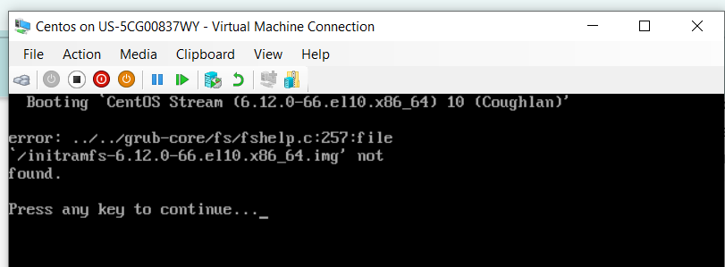

Title: Fixing "initramfs File Corrupted on Linux"

Problem:

The user is unable to boot into the Linux machine. Upon startup, the system showing "initramfs-..." not found.
 

Troubleshooting/Diagnose

	1. Booted into rescue mode using a Linux installation medium.
	
	2. Selected the option to mount the existing system (/mnt/sysimage).
	
	3. Entered the chroot environment:
	
		a. chroot /mnt/sysimage
  
  	4. Entered the boot directory.

		a. cd boot

	5. Regenerated the initramfs file
	
		a. dracut -f initramfs-$(uname -r).img $(uname -r)
		
	6. reboot

Root Cause:

	• The initramfs file was corrupted, preventing the system from booting.
	
Solution:

	1. Recreated the initramfs file from rescue mode using dracut. 
	
Outcome:

After following the above steps, user able to boot up.
