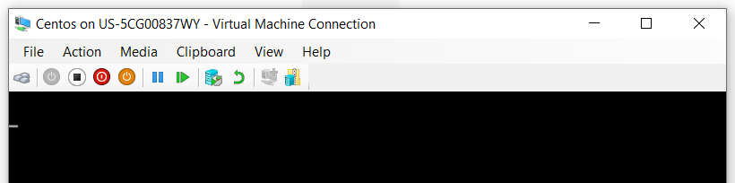

Title: Fixing "MBR" File Corrupted/Missing on Linux"

Problem:

The user is unable to boot into the Linux machine. Upon startup, the system showing blank screen with no activity.
 

Troubleshooting/Diagnose

	1. Booted into rescue mode using a Linux installation medium.
	
	2. Selected the option to mount the existing system to (/mnt/sysimage).
	
	3. Entered the chroot environment:
	
		a. chroot /mnt/sysimage
	
	4. Navigate to the /boot directory to inspect boot-related files.

		a. cd /boot

	4. Reinstall grub to restore the missing/corrupted MBR.
	
		a. grub2-install /dev/sda
		
	5. reboot

Root Cause:

	• The MBR file was corrupted, preventing the system from locate the bootable device and  load GRUB.
	
Solution:

	1. Reinstalled the GRUB bootloader using grub2-install, which recreated the MBR and restored the boot path.
	
Outcome:

After following the above steps, user able to boot up.
