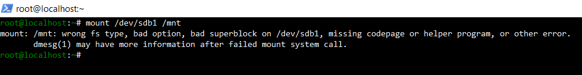
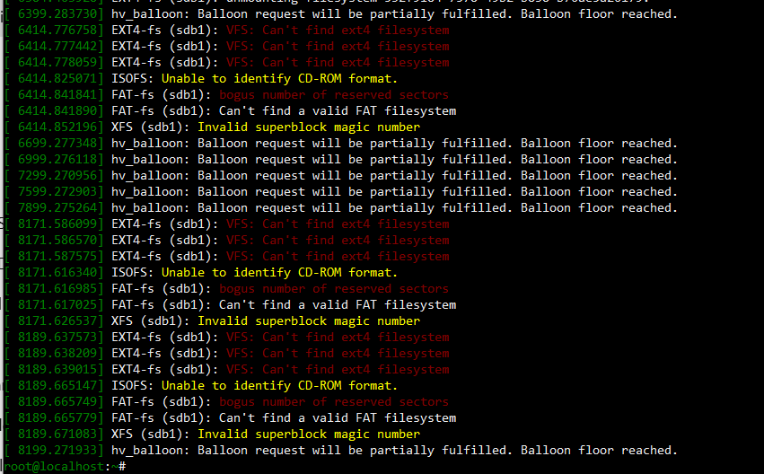
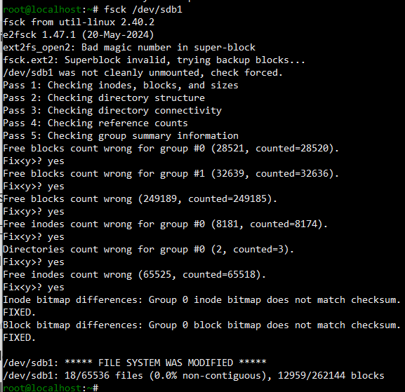

Title: Fixing "Wrong FS Type or Bad Superblock" Error when mounting /dev/sdb1

Problem:

The user is unable to mount the dev/sdb1 partition to the /mnt directory.
When attempting the mount operation, the system throws the following error:
 

Troubleshooting/Diagnose

	1. Check kernel logs for disk/filesystem errors

		a. dmesg | grep sdb
	

	
	2. Check for backup superblocks

		a. dumpe2fs /dev/sdb1 | grep -i superblock
	
	3. Run filesystem check and attempt repair

		a. fsck /dev/sdb1
	
	

Root Cause:

	Filesystem corruption on /dev/sdb1 caused an invalid or unreadable superblock, preventing the mount operation
	
Solution:

	• Used fsck to scan and fix the corrupted filesystem
	
Outcome:

After performing the repair, the filesystem was restored and the partition was successfully mounted to /mnt.
