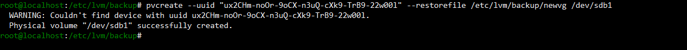

Title: Creating LVM on a 1GB Partition of /dev/sdb

Problem:

The user needs to create a Logical Volume using a 1G partition from a new disk /dev/sdb and mount it to /mnt/mylvm.

Steps

	1. Check if /dev/sdb exists and is not in use.

		a. lsblk
		b. fdisk -l /dev/sdb
	
	2. Create 1GB partition on /dev/sdb.

		a. fdisk /dev/sdb
	
	

	3. Check partition.
	
		a. lsblk
		
			§ You should now see /dev/sdb1
	
	

	4. Create Physical Volume.
	
		a. pvcreate /dev/sdb1
	
	5. Create Volume Group

		a. vgcreate new_vg /dev/sdb1 
	
	6. Create Logical Volume

		a. lvcreate -L +300M -n new_vg new_lv 

	7. Format the logical volume

		a. mkfs.ext4 /dev/new_vg/new_lv
	
	8. Mount the logical volume

		a. mkdir -p /mnt/mylvm
		b. mount /dev/new_vg/new_lv /mnt/mylvm
	
	9. Verify the mount

		a. df -h

	