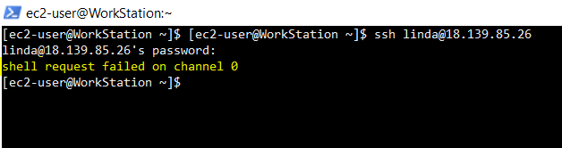
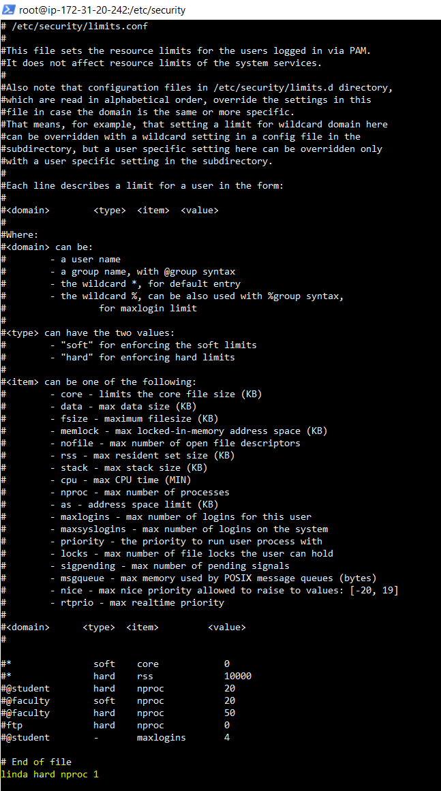

Title: Fixing "shell request failed" SSH Error
 
Problem:

A developer was unable to SSH into a remote Linux server and received the following error:

Troubleshooting/Diagnose

	1. Logged in as root to investigate the issue.
	
	2. Checked the user's last successful login attempt:
		a. lastlog -u <username>
		
	3. Reviewed SSH logs for errors related to the user
		a. journalctl -u sshd | grep <username> 
		
	4. Checked service status
		a. systemctl status sshd
		
	5. Verified the user's login information:
		a. getent passwd <username>  or cat /etc/passwd | grep <username>
		
	6. Reviewed user limits configuration 
		a. cat /etc/security/limits.conf
		

Root Cause:

The user's limit was set to 1.

Example entry from /etc/security/limits.conf:

Solution:

Edited the /etc/security/limits.conf file 

	• vi /etc/security/limits.conf
	• remove or increase the process limit
		○ linda hard nproc 1

Outcome:

After remove the limit, the developer was able to successfully SSH into the server.
