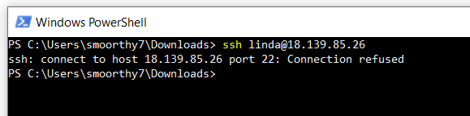

Title: Fixing "Connection refused" SSH Error
 
Problem:

A developer was unable to SSH into a remote Linux server and received the following error message:
"Connection Refused". This issue occurred while trying to access the server using password authentication.

Troubleshooting/Diagnose

	1. Access via Console / Cloud Instance
		a. Tried accessing the server directly through console access or via a cloud service's management interface to check if the issue was specific to SSH
	
	2. Checked SSHD service status
	
		a. systemctl status sshd
		
	3. Checked SSH Logs via journalctl
	
		a. Journalctl -xeu sshd
		
	4. Reviewed System Logs
	
		a. var /log/messages
		
	5. Checked SSH Configuration
	Ensured there were no misconfigurations or restrictions that could block SSH access.
	
		a. vi /etc/ssh/sshd_conf
	
	
	6. Reset user passwd
	Reset the user's password to ensure it wasn't an issue with the authentication credentials
	
		a. passwd <user>
		
	
	7. Checked user account in /etc/passwd
	Confirmed the user existed in the /etc/passwd
	
		a. cat /etc/passwd
		
	8. Checked /etc/shadow for account locking
	Opened the /etc/shadow file to investigate if the user account had any unusual settings or was locked
	
		a. cat /etc/shadow

Root Cause:

The root cause of the "Connection Refused" error was two-fold:

	• The sshd service was disabled, preventing SSH from running and accepting connections.
	• The /etc/shadow file was renamed, which caused issues with user authentication.

Solution:

	• Enabled the sshd service to allow the SSH service to start and accept connections: 
	
		○ systemctl enable sshd
		○ systemctl start sshd
	
	• Renamed the /etc/shadow file back to its original name to restore access to the password authentication system.
	

Outcome:

After implementing the resolution steps:

	• SSH access was restored, and the developer was able to log in successfully using password authentication.
	• The server's SSH service is now running, and the authentication process is functioning as expected.
	• The issue was fully resolved with no further access problems reported.
